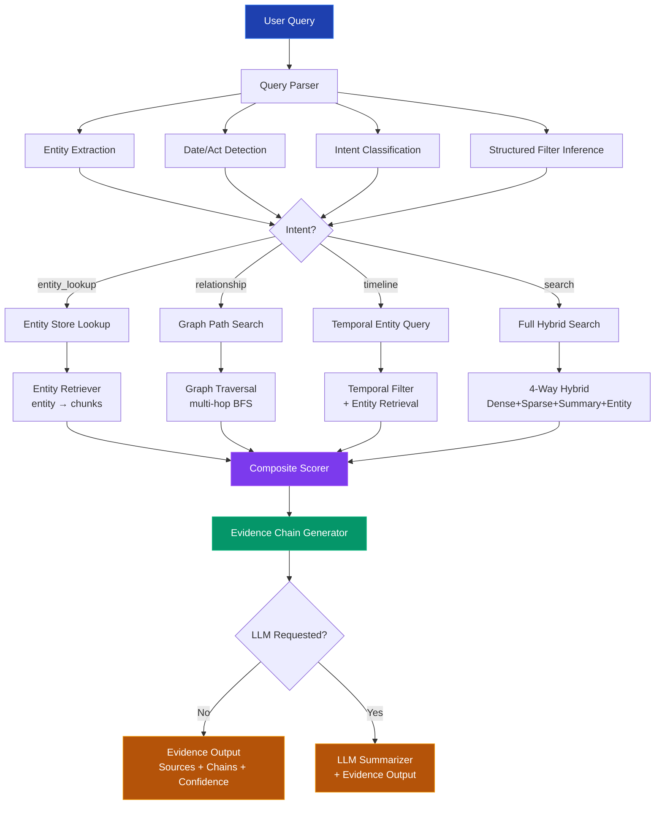

# Entity-Centric Graph Intelligence Retrieval Platform

> **Goal**: Transform the existing Epstein Files RAG chatbot into a retrieval-first, entity-centric intelligence platform with structured signal extraction, knowledge graph reasoning, multi-hop traversal, and evidence-chain output.

## Executive Summary

The current system is a solid hybrid RAG with 3-way RRF fusion (FAISS dense + BM25 sparse + multi-vector summary), spaCy NER, and GraphRAG community detection. The rebuild upgrades it from a "query → answer" chatbot into a **structured intelligence retrieval system** where entities, relationships, and evidence chains are first-class citizens — and the LLM is optional.


---

## User Review Required

> [!IMPORTANT]
> **Retrieval-First Philosophy**: The LLM will become optional. The core pipeline delivers structured evidence (documents, entities, relationships, confidence scores) *without* requiring LLM inference. The LLM is only invoked when the user explicitly requests a summarized answer.

> [!WARNING]
> **Breaking API Changes**: The `/api/chat` and `/api/search` response schemas will change significantly to include entity data, evidence chains, and graph context. The frontend will need corresponding updates.

> [!CAUTION]
> **Reindexing Required**: Phase 2 requires a one-time reindex of entity metadata. The existing FAISS index and BM25 index remain usable, but entity metadata will be rebuilt from the cached chunk data. This is a batch operation (~5-10 min depending on corpus size).

---

## Architecture Overview

### Core Modules (New / Modified)

| Module | Status | Purpose |
|--------|--------|---------|
| `backend/knowledge_graph/entity_store.py` | **NEW** | Persistent entity index with structured metadata |
| [backend/knowledge_graph/entity_extractor.py](file:///c:/Users/katuk/OneDrive/Desktop/projects/vibe/New%20folder/backend/knowledge_graph/entity_extractor.py) | MODIFY | Add structured output, legal act detection, event extraction |
| [backend/knowledge_graph/graph_builder.py](file:///c:/Users/katuk/OneDrive/Desktop/projects/vibe/New%20folder/backend/knowledge_graph/graph_builder.py) | MODIFY | Typed edges, multi-hop traversal, path scoring |
| `backend/knowledge_graph/graph_traversal.py` | **NEW** | Multi-hop reasoning engine with configurable depth |
| `backend/knowledge_graph/evidence_chain.py` | **NEW** | Evidence chain generator from graph paths |
| `backend/retrieval/entity_retriever.py` | **NEW** | Entity-first retrieval path |
| [backend/retrieval/hybrid_retriever.py](file:///c:/Users/katuk/OneDrive/Desktop/projects/vibe/New%20folder/backend/retrieval/hybrid_retriever.py) | MODIFY | Add entity-aware scoring, 4-way fusion |
| `backend/retrieval/composite_scorer.py` | **NEW** | Unified scoring: semantic + keyword + entity + graph |
| `backend/retrieval/query_parser.py` | **NEW** | Query entity extraction + structured filter inference |
| [backend/api/routes/search.py](file:///c:/Users/katuk/OneDrive/Desktop/projects/vibe/New%20folder/backend/api/routes/search.py) | MODIFY | Evidence-first response, graph context |
| [backend/api/routes/chat.py](file:///c:/Users/katuk/OneDrive/Desktop/projects/vibe/New%20folder/backend/api/routes/chat.py) | MODIFY | Optional LLM, evidence output mode |
| [backend/api/routes/graph.py](file:///c:/Users/katuk/OneDrive/Desktop/projects/vibe/New%20folder/backend/api/routes/graph.py) | MODIFY | Multi-hop traversal, path queries |
| `backend/api/routes/intelligence.py` | **NEW** | Entity-centric intelligence API |
| [backend/evaluation/metrics.py](file:///c:/Users/katuk/OneDrive/Desktop/projects/vibe/New%20folder/backend/evaluation/metrics.py) | MODIFY | Add Recall@k, Precision, MRR |
| [backend/evaluation/query_tracker.py](file:///c:/Users/katuk/OneDrive/Desktop/projects/vibe/New%20folder/backend/evaluation/query_tracker.py) | MODIFY | Failure analysis, observability |
| [backend/config.py](file:///c:/Users/katuk/OneDrive/Desktop/projects/vibe/New%20folder/backend/config.py) | MODIFY | New configuration parameters |

---

## Proposed Changes

### Phase 1: Baseline Hybrid Retrieval Hardening

> Solidify the foundation. Upgrade entity extraction to produce structured, indexable metadata. Add entity-aware tokenization and structured field search.

---

#### [MODIFY] [entity_extractor.py](file:///c:/Users/katuk/OneDrive/Desktop/projects/vibe/New%20folder/backend/knowledge_graph/entity_extractor.py)

Extend the extractor to produce richer, structured metadata:

- Add **legal act detection** (`LAW` entities: "Title IX", "Section 2255", etc.) with regex patterns for act citations
- Add **event extraction** (depositions, hearings, arrests, meetings) from context patterns
- Add **temporal anchoring** — associate each entity with date mentions in proximity
- Add **relationship hints** from syntactic patterns ("X met with Y", "X employed by Y")
- Output structured entity records:

```python
{
    "name": "Jeffrey Epstein",
    "normalized": "Jeffrey Epstein", 
    "type": "PERSON",
    "mentions": 342,
    "dates_associated": ["2005", "2008", "2019"],
    "co_occurring_entities": ["Ghislaine Maxwell", "Palm Beach"],
    "source_documents": ["doc_001.pdf", "doc_042.pdf"],
    "chunk_ids": ["abc123", "def456"],
    "legal_acts_mentioned": ["Title 18 § 2255"],
    "events_involved": ["2005 arrest", "2008 plea deal"]
}
```

---

#### [NEW] [entity_store.py](file:///c:/Users/katuk/OneDrive/Desktop/projects/vibe/New%20folder/backend/knowledge_graph/entity_store.py)

Persistent entity index stored as JSON + in-memory lookup:

- **Fields**: name, type, aliases, mention_count, source_docs, chunk_ids, dates, co_entities, legal_acts, events
- **Lookup methods**: by name (fuzzy), by type, by date range, by co-occurrence
- **Persistence**: `data/entity_index.json` with incremental update support
- **Scalability**: In-memory dict for <100K entities, with optional SQLite backend for larger corpora

---

#### [MODIFY] [sparse_retriever.py](file:///c:/Users/katuk/OneDrive/Desktop/projects/vibe/New%20folder/backend/retrieval/sparse_retriever.py)

Add entity-aware BM25:

- Boost entity tokens in BM25 scoring (2x weight for recognized entity names)
- Add structured field search: search by entity name, date range, document type as pre-filters before BM25

---

#### [MODIFY] [config.py](file:///c:/Users/katuk/OneDrive/Desktop/projects/vibe/New%20folder/backend/config.py)

Add new configuration:

```python
# Entity-centric retrieval
entity_boost_weight: float = 2.0      # BM25 entity token boost
graph_max_hops: int = 3               # Multi-hop traversal depth
graph_hop_decay: float = 0.7          # Score decay per hop
entity_top_k: int = 20                # Entity retrieval count
evidence_chain_max: int = 5           # Max evidence chains per query
composite_weights: dict = {           # Scoring weights
    "semantic": 0.35,
    "keyword": 0.20,
    "entity": 0.25,
    "graph": 0.20,
}
```

---

### Phase 2: Entity-Centric Search Layer

> Make entities first-class retrieval objects. The system can now answer "show me everything related to entity X" without any LLM.

---

#### [NEW] [query_parser.py](file:///c:/Users/katuk/OneDrive/Desktop/projects/vibe/New%20folder/backend/retrieval/query_parser.py)

Structured query decomposition:

```python
class ParsedQuery:
    raw_query: str
    entities_mentioned: list[EntityRef]    # Extracted entities from query
    dates_mentioned: list[str]             # Date references
    legal_acts: list[str]                  # Legal act references  
    intent: str                            # "entity_lookup", "relationship", "timeline", "search"
    structured_filters: dict               # Auto-inferred filters
    search_keywords: list[str]             # Non-entity keywords for BM25
```

- Uses the existing spaCy NER + entity store for entity resolution
- Classifies query intent (entity lookup vs. relationship query vs. free search)
- Extracts structured filters from natural language

---

#### [NEW] [entity_retriever.py](file:///c:/Users/katuk/OneDrive/Desktop/projects/vibe/New%20folder/backend/retrieval/entity_retriever.py)

Entity-first retrieval path:

```
Query → Extract entities → Entity Store lookup → Get chunk_ids → 
Retrieve chunks → Score by entity relevance → Return with entity context
```

- **Direct entity retrieval**: Given an entity name, find all chunks mentioning it
- **Entity expansion**: Given entity X, find related entities from co-occurrence graph, retrieve their chunks too
- **Entity-document matrix**: Precomputed mapping from entities → documents for O(1) document lookup

---

#### [MODIFY] [hybrid_retriever.py](file:///c:/Users/katuk/OneDrive/Desktop/projects/vibe/New%20folder/backend/retrieval/hybrid_retriever.py)

Upgrade to **4-way** hybrid retrieval with entity signal:

```
Signal 1: Dense (FAISS) → cosine similarity
Signal 2: Sparse (BM25) → keyword relevance  
Signal 3: Summary (Multi-vector) → summary-level matching
Signal 4: Entity (Entity Retriever) → entity overlap scoring  ← NEW
```

New RRF fusion weights:
- Dense: 1.0
- Sparse: 1.0
- Summary: 0.8
- Entity: 1.2 (entity signal gets slight boost)

---

### Phase 3: Graph Reasoning & Multi-Hop Retrieval

> The knowledge graph becomes a reasoning engine. Multi-hop traversal discovers indirect connections between entities.

---

#### [MODIFY] [graph_builder.py](file:///c:/Users/katuk/OneDrive/Desktop/projects/vibe/New%20folder/backend/knowledge_graph/graph_builder.py)

Upgrade graph schema with **typed, weighted edges**:

```python
# Current: Simple co-occurrence edges
# G.add_edge("Epstein", "Maxwell", weight=co_occurrence_count)

# New: Typed edges with metadata
edge_types = {
    "mentioned_with": {"strength": "co-occurrence count"},
    "involved_in": {"context": "event/case"},
    "employed_by": {"dates": "employment period"},
    "associated_with": {"nature": "relationship type"},
    "located_at": {"temporal": "date range"},
    "referenced_in": {"source": "document/act"},
}

# Edge structure:
G.add_edge("Epstein", "Maxwell", 
    type="associated_with",
    weight=0.95,
    evidence_chunks=["chunk_abc", "chunk_def"],
    dates=["2001-2019"],
    context="close associate, co-defendant"
)
```

- Node attributes enriched from entity store (type, dates, mention_count, etc.)
- Edge types inferred from syntactic patterns during entity extraction
- Community detection retrained with typed edges

---

#### [NEW] [graph_traversal.py](file:///c:/Users/katuk/OneDrive/Desktop/projects/vibe/New%20folder/backend/knowledge_graph/graph_traversal.py)

Multi-hop reasoning engine:

```python
class GraphTraversal:
    def multi_hop_search(
        self, 
        start_entities: list[str],
        max_hops: int = 3,
        min_edge_weight: float = 0.1,
        edge_type_filter: list[str] | None = None,
    ) -> list[TraversalPath]:
        """
        BFS/DFS from start entities, discovering connected entities.
        Returns scored paths with evidence chains.
        """
```

**Scoring formula for multi-hop paths:**

$$\text{PathScore}(p) = \prod_{i=1}^{n} w(e_i) \cdot \alpha^{n-1}$$

Where:
- $w(e_i)$ = edge weight (normalized co-occurrence strength)
- $\alpha$ = hop decay factor (default 0.7)
- $n$ = number of hops

**Path ranking:**
- Direct connections (1-hop): base score × 1.0
- Indirect connections (2-hop): base score × 0.7 
- Transitive connections (3-hop): base score × 0.49

---

#### [NEW] [evidence_chain.py](file:///c:/Users/katuk/OneDrive/Desktop/projects/vibe/New%20folder/backend/knowledge_graph/evidence_chain.py)

Generate human-readable reasoning chains from graph paths:

```python
class EvidenceChain:
    entities: list[str]           # ["Epstein", "Maxwell", "Prince Andrew"]
    relationships: list[str]      # ["associated_with", "mentioned_with"]
    supporting_chunks: list[dict] # Source document excerpts
    confidence: float             # 0.0 - 1.0
    path_description: str         # "Epstein → (associated_with) → Maxwell → (mentioned_with) → Prince Andrew"
    temporal_range: tuple[str, str]  # ("2001", "2019")
```

- Walk each graph path and collect supporting evidence from chunks
- Compute chain confidence as product of edge weights with decay
- Generate natural language descriptions of the reasoning path

---

### Phase 4: Scoring, Evidence Output, Observability

> The final layer: composite scoring, evidence-first output, and system observability.

---

#### [NEW] [composite_scorer.py](file:///c:/Users/katuk/OneDrive/Desktop/projects/vibe/New%20folder/backend/retrieval/composite_scorer.py)

Unified scoring function:

```python
FinalScore(d, q) = w_s · Semantic(d, q) + w_k · Keyword(d, q) + w_e · Entity(d, q) + w_g · Graph(d, q)
```

| Component | Method | Weight |
|-----------|--------|--------|
| **Semantic** | Cosine similarity from FAISS | 0.35 |
| **Keyword** | BM25 score (normalized) | 0.20 |
| **Entity** | Jaccard overlap (query entities ∩ chunk entities) | 0.25 |
| **Graph** | Path score from graph traversal | 0.20 |

Additional boosting signals:
- **Temporal relevance**: +10% if chunk dates match query date range
- **Entity type match**: +15% if chunk contains same entity type as query focus
- **Multi-source confirmation**: +20% if entity appears in multiple documents
- **Community relevance**: +10% if entity is in a relevant Leiden community

---

#### [MODIFY] [search.py](file:///c:/Users/katuk/OneDrive/Desktop/projects/vibe/New%20folder/backend/api/routes/search.py)

New evidence-first response schema:

```python
class IntelligenceResponse(BaseModel):
    # Core results
    results: list[ScoredDocument]
    
    # Entity context
    query_entities: list[EntityRef]
    discovered_entities: list[EntityRef]  # From graph traversal
    
    # Evidence chains
    evidence_chains: list[EvidenceChain]
    
    # Metadata
    confidence: float
    retrieval_mode: str  # "hybrid", "entity", "graph"
    latency: dict
    
    # Optional LLM summary (only if requested)
    summary: str | None = None
```

---

#### [NEW] [intelligence.py](file:///c:/Users/katuk/OneDrive/Desktop/projects/vibe/New%20folder/backend/api/routes/intelligence.py)

New entity-centric intelligence API:

```python
# Entity profile with all connections
GET /api/intelligence/entity/{name}
# → Full entity profile, connections, timeline, documents

# Multi-hop path between entities
GET /api/intelligence/path?from=X&to=Y&max_hops=3
# → All paths, evidence chains, confidence scores

# Entity timeline
GET /api/intelligence/timeline/{name}
# → Chronological events involving this entity

# Entity cluster / community
GET /api/intelligence/cluster/{entity}
# → All entities in the same Leiden community

# Structured search  
POST /api/intelligence/search
# → Evidence-first search with entity context and graph reasoning
```

---

#### [MODIFY] [chat.py](file:///c:/Users/katuk/OneDrive/Desktop/projects/vibe/New%20folder/backend/api/routes/chat.py)

Refactor to support **three modes**:

1. **Evidence mode** (default): Return structured evidence without LLM
2. **Summary mode**: Evidence + LLM-generated summary
3. **Legacy mode**: Current chatbot behavior (backward compatible)

---

#### [MODIFY] [metrics.py](file:///c:/Users/katuk/OneDrive/Desktop/projects/vibe/New%20folder/backend/evaluation/metrics.py)

Add retrieval quality metrics:

```python
class RetrievalMetrics:
    def recall_at_k(self, relevant_ids, retrieved_ids, k) -> float
    def precision_at_k(self, relevant_ids, retrieved_ids, k) -> float  
    def mrr(self, relevant_ids, retrieved_ids) -> float
    def ndcg_at_k(self, relevance_scores, k) -> float
    def entity_recall(self, expected_entities, found_entities) -> float
    def path_coverage(self, expected_paths, found_paths) -> float
```

---

#### [MODIFY] [query_tracker.py](file:///c:/Users/katuk/OneDrive/Desktop/projects/vibe/New%20folder/backend/evaluation/query_tracker.py)

Add observability:

- Log each pipeline stage with timing
- Track entity extraction accuracy
- Track graph traversal coverage
- Failure mode analysis (no entities found, no paths found, low confidence)
- Export metrics to [data/metrics.json](file:///c:/Users/katuk/OneDrive/Desktop/projects/vibe/New%20folder/data/metrics.json) for dashboarding

---

## Complete Retrieval Pipeline (New)



---

## Mathematical Scoring Strategies

### 1. Hybrid Retrieval Fusion (4-Way RRF)

$$\text{RRF}(d) = \sum_{r \in \{dense, sparse, summary, entity\}} \frac{w_r}{k + \text{rank}_r(d)}$$

Where $k = 60$ (RRF constant), and weights: $w_{dense} = 1.0$, $w_{sparse} = 1.0$, $w_{summary} = 0.8$, $w_{entity} = 1.2$

### 2. Entity Overlap Score

$$\text{EntityScore}(q, d) = \frac{|E_q \cap E_d|}{|E_q|} \cdot \log(1 + \text{mention\_count}(d))$$

### 3. Graph Path Strength

$$\text{PathStrength}(p) = \prod_{i=1}^{n} w(e_i) \cdot \alpha^{n-1} \cdot \text{TemporalRelevance}(p)$$

$$\text{TemporalRelevance}(p) = \begin{cases} 1.2 & \text{if dates overlap with query} \\ 1.0 & \text{if no temporal context} \\ 0.8 & \text{if dates outside query range} \end{cases}$$

### 4. Final Composite Score

$$S(d, q) = 0.35 \cdot S_{semantic} + 0.20 \cdot S_{keyword} + 0.25 \cdot S_{entity} + 0.20 \cdot S_{graph}$$

With boosting modifiers applied multiplicatively.

---

## Development Roadmap

| Phase | Focus | Timeline | Key Deliverable |
|-------|-------|----------|-----------------|
| **1** | Baseline hardening | Week 1-2 | Entity store, structured metadata, entity-aware BM25 |
| **2** | Entity-centric search | Week 3-4 | Query parser, entity retriever, 4-way hybrid |
| **3** | Graph reasoning | Week 5-7 | Multi-hop traversal, evidence chains, typed edges |
| **4** | Scoring & observability | Week 8-9 | Composite scorer, evidence output, metrics |

---

## Scalability Design

| Concern | Strategy |
|---------|----------|
| **Offline embedding** | Kaggle notebooks for batch embedding (existing), entity extraction added to pipeline |
| **Local retrieval** | FAISS + BM25 + entity store all file-based, no external DB required |
| **Cloud inference** | NVIDIA NIM for reranking and optional LLM (existing) |
| **Incremental updates** | New documents → extract entities → update entity store → rebuild graph edges → append to FAISS |
| **Graph scaling** | NetworkX for <50K nodes; Neo4j migration path for larger graphs |

---

## Verification Plan

### Automated Tests

**1. Entity Extraction Accuracy Test**
```bash
cd "c:\Users\katuk\OneDrive\Desktop\projects\vibe\New folder"
python -m pytest backend/tests/test_entity_extraction.py -v
```
- Test entity extraction on sample chunks with known entities
- Verify all entity types are detected: PERSON, ORG, LAW, DATE, EVENT
- Verify normalization and alias resolution

**2. Entity Store CRUD Test**
```bash
python -m pytest backend/tests/test_entity_store.py -v
```
- Test add/lookup/filter/persistence operations
- Test fuzzy name matching
- Test incremental updates

**3. Graph Traversal Test**
```bash
python -m pytest backend/tests/test_graph_traversal.py -v
```
- Test multi-hop BFS with known graph topology
- Verify path scoring matches expected values
- Test edge type filtering

**4. Composite Scorer Test**
```bash
python -m pytest backend/tests/test_composite_scorer.py -v
```
- Test scoring formula with known inputs
- Verify weight contributions
- Test boosting modifiers

**5. Integration Test — Full Pipeline**
```bash
python -m pytest backend/tests/test_intelligence_pipeline.py -v
```
- End-to-end: query → parse → retrieve → score → evidence chain
- Verify response schema matches `IntelligenceResponse`

### Manual Verification

**6. API Smoke Test** — Run the server and test endpoints:
```bash
cd "c:\Users\katuk\OneDrive\Desktop\projects\vibe\New folder"
python -m uvicorn backend.main:app --port 8000
```
Then test with:
1. `GET /api/intelligence/entity/Jeffrey%20Epstein` → should return entity profile with connections
2. `GET /api/intelligence/path?from=Jeffrey%20Epstein&to=Prince%20Andrew&max_hops=3` → should return paths
3. `POST /api/intelligence/search` with `{"query": "Who visited Epstein's island in 2005?"}` → should return evidence-first results

**7. User Manual Testing** (requires user to verify):
- Start the server and frontend
- Search for an entity name → verify entity card appears with connections
- Click on a connected entity → verify graph traversal expands
- Check that evidence chains show source documents with confidence scores
- Verify that timeline display works for entities with date associations
